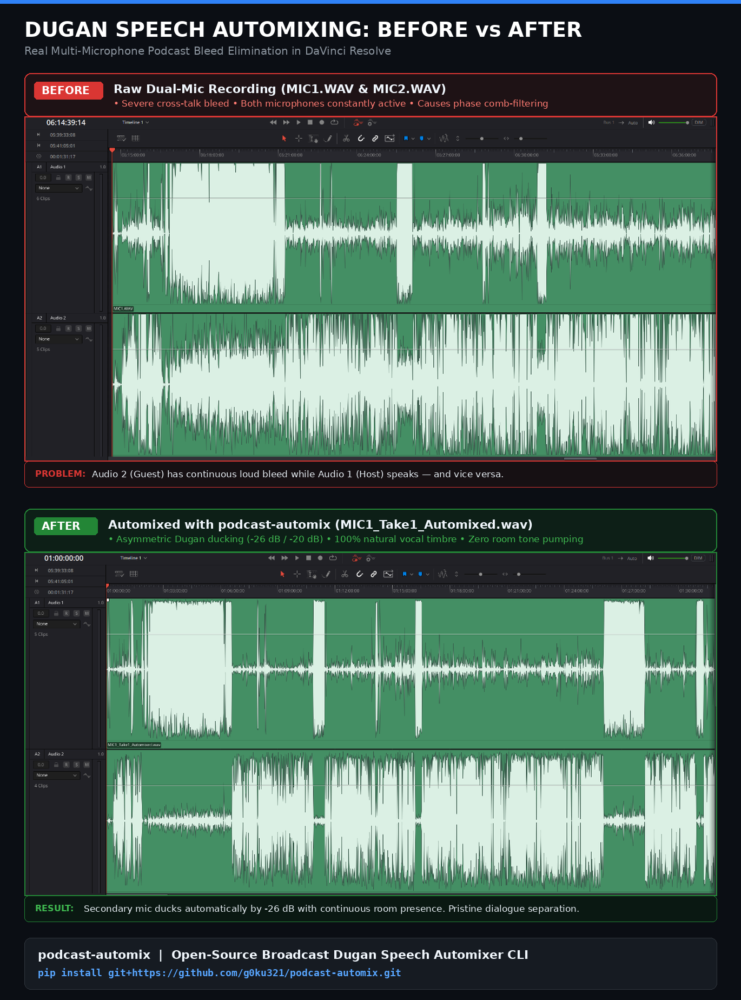

# 🎙️ podcast-automix

[](https://opensource.org/licenses/MIT)
[](https://www.python.org/)

A production-grade, memory-safe command-line tool that automatically eliminates cross-talk microphone bleed in 2-speaker podcast recordings (such as from a Zoom PodTrak P4, Rodecaster Pro, or multi-channel audio interface).

It implements the **Deep Dugan Speech Automixer algorithm**:
* **100% Original Voice Timbre:** Zero AI neural voice filtering, zero EQ coloration, zero comb filtering / phase cancellation.
* **Deep Bleed Elimination:** Automatically ducks the secondary microphone by **-26 dB** (Guest) and **-20 dB** (Host) whenever the other speaker is talking.
* **Continuous Room Tone:** A 250ms release hold combined with a 25ms cosine smoothing window prevents gate chatter, silence cliffs, and room tone pumping.
* **Streaming Memory Architecture:** Fixed ~30 MB RAM footprint streaming in 60-second chunks—process 5-minute clips or 5-hour marathons without memory pressure.
* **Video Production Ready:** Automatically exports broadcast-standard **48 kHz 24-bit PCM WAV** (exact millisecond timeline sync for Premiere / DaVinci Resolve) and **320 kbps MP3**.

<p align="center">
  
</p>

---

## ⚡ Quick Start

### 1. Prerequisites
- **Python 3.8+**
- **FFmpeg** (installed and available in system `$PATH`):
  ```bash
  # Debian / Ubuntu:
  sudo apt install ffmpeg

  # macOS (Homebrew):
  brew install ffmpeg

  # Windows (Chocolatey / Scoop):
  choco install ffmpeg
  ```

### 2. Installation

You can install `podcast-automix` directly via pip:

```bash
# Clone and install locally
git clone https://github.com/g0ku321/podcast-automix.git
cd podcast-automix
pip install .
```

Or install directly from GitHub without cloning manually:
```bash
pip install git+https://github.com/g0ku321/podcast-automix.git
```

---

## 🚀 Usage

Place your dual-mic WAV recordings from your podcast session into a folder (e.g. `Episode 17/`). By default, recorders like Zoom PodTrak label tracks as `MIC1.WAV` (Host) and `MIC2.WAV` (Guest).

Run:
```bash
podcast-automix "/path/to/Episode 17"
```

### What Happens Automatically:
1. **Pair Discovery:** Scans the folder and matches every take automatically (`MIC1.WAV` <-> `MIC2.WAV`, `MIC1 2.WAV` <-> `MIC2 2.WAV`, etc.).
2. **Chunk Processing:** Streams both channels synchronously in 60-second chunks, applying Dugan gain-sharing.
3. **Automated Output Folder:** Creates `/path/to/Episode 17 AUTOMIXED/` containing:
   - `<Take>_Mic1_Automixed.wav` (48 kHz 24-bit PCM WAV)
   - `<Take>_Mic1_Automixed.mp3` (320 kbps MP3)
   - `<Take>_Mic2_Automixed.wav` (48 kHz 24-bit PCM WAV)
   - `<Take>_Mic2_Automixed.mp3` (320 kbps MP3)

---

## ⚙️ Command-Line Options

```text
usage: podcast-automix [-h] [-o OUTPUT_DIR] [--mic1-pattern MIC1_PATTERN]
                       [--mic2-pattern MIC2_PATTERN] [--mic1-floor MIC1_FLOOR]
                       [--mic2-floor MIC2_FLOOR] [--mic1-boost MIC1_BOOST]
                       [--chunk-size CHUNK_SIZE] [--skip-mp3] [--skip-wav]
                       input_dir
```

| Flag | Default | Description |
| :--- | :--- | :--- |
| `input_dir` | *(required)* | Path to directory containing the raw multi-mic WAV files |
| `-o`, `--output-dir` | `<input_dir> AUTOMIXED` | Custom destination folder for automixed exports |
| `--mic1-floor` | `-20.0` | Maximum attenuation (in dB) on Mic 1 when Mic 2 is dominant |
| `--mic2-floor` | `-26.0` | Maximum attenuation (in dB) on Mic 2 when Mic 1 is dominant |
| `--mic1-boost` | `7.0` | Priority boost (in dB) for Mic 1 detector (balances high-gain guest mics) |
| `--chunk-size` | `60` | Streaming buffer window in seconds (keeps RAM at ~30 MB) |
| `--skip-mp3` | `False` | Skip MP3 encoding (WAV export only) |
| `--skip-wav` | `False` | Skip 48kHz WAV export (MP3 export only) |
| `--mic1-pattern` | `MIC1*.WAV` | Custom glob pattern for Host microphone files |
| `--mic2-pattern` | `MIC2*.WAV` | Custom glob pattern for Guest microphone files |

### Examples:

```bash
# Custom export folder
podcast-automix "/path/to/E17" -o "/path/to/Mastered"

# Deeper attenuation for very loud recording environments
podcast-automix "/path/to/E17" --mic1-floor -24 --mic2-floor -30

# Fast export for audio-only podcasts (MP3 only)
podcast-automix "/path/to/E17" --skip-wav
```

---

## 🧠 How It Works (The Dugan Algorithm)

Traditional downward gates and noise-suppressors fail on multi-mic podcasts because:
1. **Noise Gates** cut off quiet consonants ("th", "f", "s") and cause jarring drops in ambient room tone.
2. **AI Voice Cleaners** introduce watery, comb-filtered artifacts and destroy the natural richness of good microphones.

`podcast-automix` solves this through **gain-sharing speech automixing**:
1. **Envelope Detection:** Dual exponential peak-detectors calculate instantaneous speech energy with a 12 ms attack and 250 ms release.
2. **Gain Normalization:** At every sample, gain is apportioned across channels such that the total system gain remains constant ($G_1 + G_2 = 1$). When Speaker 1 speaks, Mic 2 is smoothly attenuated down to its ducking floor (e.g. -26 dB) and vice versa.
3. **Continuous Room Tone:** Ambient background noise is never artificially silenced. Instead, the total room presence remains seamlessly constant, even when both speakers pause or talk simultaneously.
4. **Hanning Cosine Smoothing:** A 25 ms convolutional smoothing filter guarantees zero audio clicks, zipper noise, or abrupt gain jumps.

---

## 📄 License

This project is licensed under the [MIT License](LICENSE).
